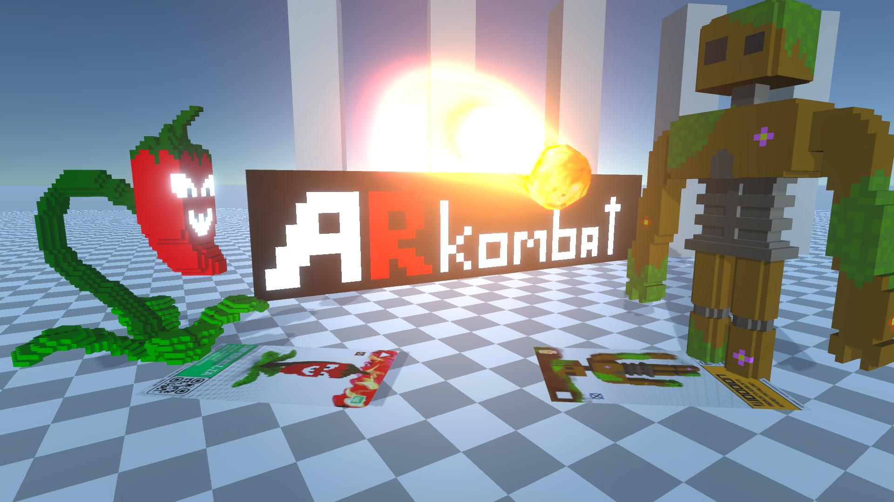
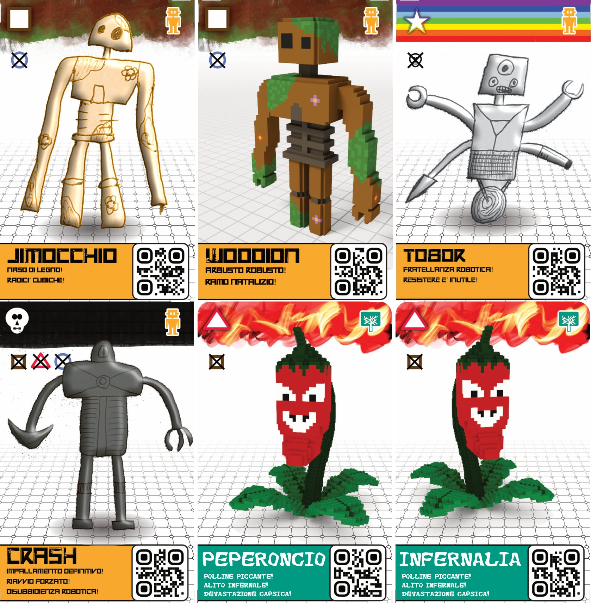
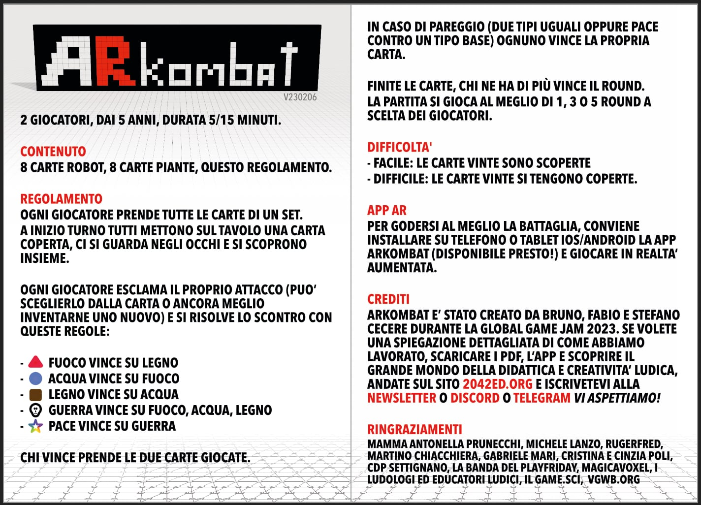

# ARKombat - card game

[Repository GitHub di questo gioco](https://github.com/2042ed/JAM.ARKombat)

2 giocatori, dai 5 anni, durata 5/15 minuti.

## Contenuto
8 carte Robot, 8 carte Piante, questo regolamento.

NB: il pdf con tutte le carte è in questo repository: 

## Regolamento
ogni giocatore prende tutte le carte di un set.
a inizio turno tutti mettono sul tavolo una carta coperta, ci si guarda negli occhi e si scoprono insieme.

Ogni giocatore esclama il proprio attacco (puo’ sceglierlo dalla carta o ancora meglio inventarne uno nuovo) e si risolve lo scontro con queste regole:

- 🔺 Fuoco vince su Legno
- 🔵 Acqua vince su Fuoco
- 🟫 Legno vince su Acqua
- 💀 Guerra vince su Fuoco, Acqua, Legno
- ⭐️ pace vince su Guerra

Chi vince prende le due carte giocate.
In caso di pareggio (due tipi uguali oppure pace contro un tipo base) ognuno vince la propria carta.

finite le carte, chi ne ha di più vince il round.
la partita si gioca al meglio di 1, 3 o 5 round a scelta dei giocatori.

## Difficolta'

- Facile: le carte vinte sono scoperte
- Difficile: le carte vinte si tengono coperte.

## App AR
per godersi al meglio la battaglia, conviene installare su telefono o tablet ios/android la app arkombat (disponibile presto!) e giocare in realta’ aumentata.

## Crediti
ARKombat e’ stato creato da bruno, fabio e stefano cecere durante la global game jam 2023. se volete una spiegazione dettagliata di come abbiamo lavorato, scaricare i pdf, l’app e scoprire il grande mondo della didattica e creativita’ ludica, andate sul sito <https://2042ed.org> e iscrivetevi alla newsletter o discord o telegram vi aspettiamo!

## Ringraziamenti
mamma antonella prunecchi, michele lanzo, rugerfred, martino chiacchiera, gabriele mari, cristina e cinzia poli, cdp settignano, la banda del playfriday, magicavoxel, i ludologi ed educatori ludici, il game.sci, <https://vgwb.org>

## Global Game Jam 2023
La esntry di questo gioco è: <https://globalgamejam.org/2023/games/arkombat-card-game-5>

## ©️ License
Questo gioco è copyright Stefano, Fabio e Bruno Cecere, 2023.
